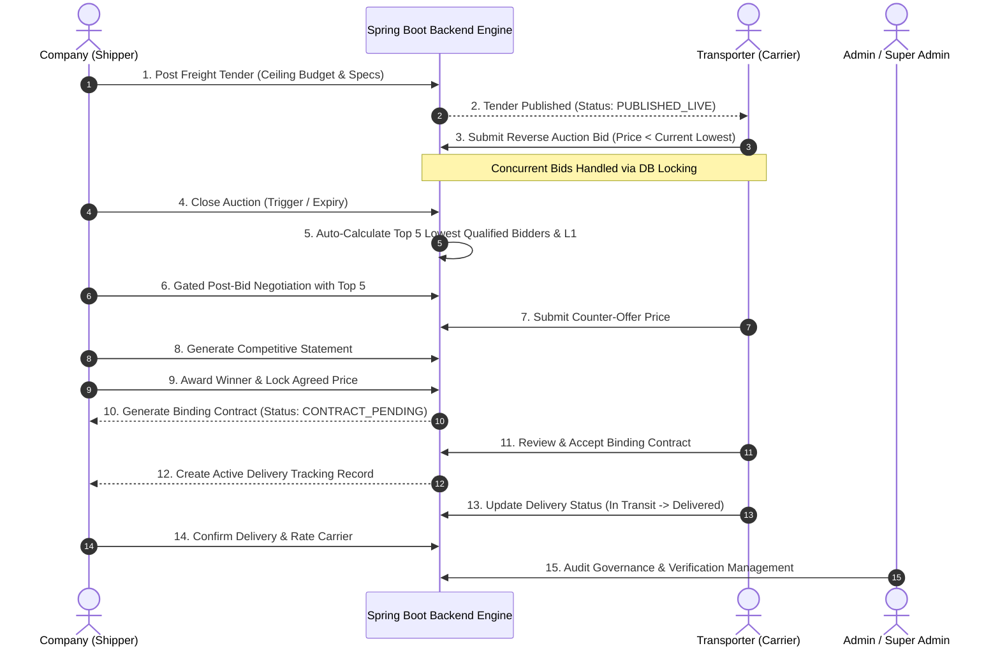
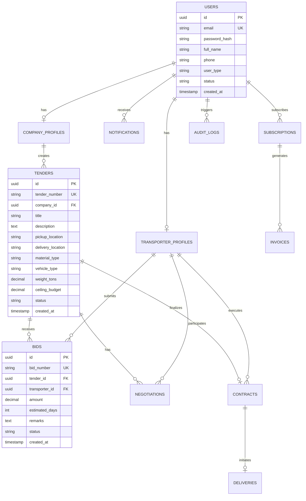
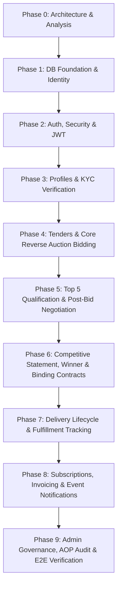

# BIDHAUL BACKEND — PHASE 0: COMPLETE PROJECT ANALYSIS & IMPLEMENTATION PLAN

> **Document Type:** Master Architecture & Phased Backend Implementation Plan  
> **Target Application:** BidHaul B2B Reverse Auction Logistics Platform  
> **Source Baseline:** Feature-Complete Flutter Frontend & Spring Boot 3.4 / Java 21 Foundation  
> **Author:** Antigravity AI (Google DeepMind Team)  
> **Status:** Completed Phase 0 (Analysis & Architecture Design Only — No Implementation Code Written)

---

## 1. Executive Summary & System Overview

**BidHaul** is a high-performance B2B Reverse Auction Logistics Platform designed to connect **Freight Shippers (Companies)** with **Fleet Carriers (Transporters)**. The core business process relies on reverse bidding where shippers publish cargo transport tenders, and carriers submit progressively lower price bids. The platform manages the entire lifecycle: initial tender posting, real-time reverse bidding, automated Top 5 bidder qualification, post-bid counter-negotiations, comparative statement evaluation, winner selection, legal contract binding, active delivery tracking, subscription management, and complete administrative governance.

This document presents the **Phase 0 Complete Project Analysis & Phased Backend Implementation Plan**. It is derived from a deep inspection of both the feature-complete Flutter mobile/web client and the Spring Boot backend codebase. It establishes authoritative guidelines, domain entity mappings, status lifecycle transitions, reverse auction concurrency handling, security policies, database migrations, and a 10-phase execution roadmap.

---

## 2. Discovered Repository Architecture

The repository structure has been fully inspected at `d:\Reverse Option System`:

```text
Reverse Option System/
├── frontend/                        ← Feature-Complete Flutter Application
│   ├── lib/
│   │   ├── models/                  ← 33 Dart UI Data Models
│   │   ├── dummy/                   ← 33 Mock Data Providers
│   │   ├── screens/                 ← Screens grouped by Auth, Company, Transporter, Admin, Profile
│   │   ├── widgets/                 ← Reusable UI Components
│   │   ├── core/                    ← Constants, Helpers, Routes, Utils
│   │   ├── theme/                   ← Executive Dark Espresso & Warm Gold Design System
│   │   └── main.dart                ← Application Entry Point
│   ├── docs/
│   │   └── BIDHAUL_FRONTEND_BACKEND_CONTRACT.md ← Integration Contract Document
│   └── pubspec.yaml
├── backend/                         ← Spring Boot 3.4 / Java 21 Foundation
│   ├── src/
│   │   ├── main/
│   │   │   ├── java/bidhaul_backend/
│   │   │   │   └── BackendApplication.java
│   │   │   └── resources/
│   │   │       ├── application.properties ← Neon PostgreSQL Configuration
│   │   │       └── db/migration/    ← Flyway Migrations (Currently Empty)
│   │   └── test/
│   │       └── java/bidhaul_backend/
│   │           └── BackendApplicationTests.java
│   ├── pom.xml                      ← Maven Project Descriptor
│   └── .env                         ← Local Environment Secrets
└── docs/
    └── BIDHAUL_BACKEND_IMPLEMENTATION_PLAN.md ← (This Master Architecture Plan)
```

### Backend Foundation Technical Stack
* **Java Version:** 21 LTS
* **Spring Boot Version:** 3.4.x (configured with Maven `spring-boot-starter-parent` 4.0.7 / 3.4.x compatible parent)
* **Build System:** Apache Maven
* **Database Engine:** Neon Serverless PostgreSQL (Driver: `org.postgresql.Driver`)
* **Migration Framework:** Flyway (`flyway-database-postgresql`)
* **Security Framework:** Spring Security (`spring-boot-starter-security`)
* **Persistence Framework:** Spring Data JPA (`spring-boot-starter-data-jpa` with Hibernate `ddl-auto=validate`)
* **Validation:** Bean Validation (`spring-boot-starter-validation`)
* **Utilities & Monitoring:** Lombok, Spring Boot Actuator

---

## 3. Database Connection & Security Compliance

### Configuration Assessment
The backend foundation is currently configured in `application.properties` and `.env` to connect to a Neon PostgreSQL instance with SSL enabled (`sslmode=require`). `spring.jpa.hibernate.ddl-auto` is correctly set to `validate`, ensuring Hibernate does NOT auto-generate production tables and forcing schema evolution via Flyway.

### Security Rule Compliance
> [!IMPORTANT]
> **Zero Credential Exposure Guarantee:** Database passwords, connection strings with embedded credentials, JWT secrets, and API tokens MUST NOT be exposed in documentation, source code repositories, or log outputs.

### Recommendations for Future Phases
1. **Environment Variable Externalization:** Replace hardcoded credentials in `application.properties` with Spring environment placeholders:
   ```properties
   spring.datasource.url=${SPRING_DATASOURCE_URL}
   spring.datasource.username=${SPRING_DATASOURCE_USERNAME}
   spring.datasource.password=${SPRING_DATASOURCE_PASSWORD}
   ```
2. **Git Hygiene:** Ensure `.env` and sensitive property files are strictly listed in `.gitignore`.

---

## 4. Product Domain Model & Workflow Analysis

### Core End-to-End Business Flow


---

## 5. Frontend vs. Backend Gap Analysis & Architectural Decisions

A primary objective of Phase 0 is to evaluate the 33 Flutter models in `lib/models/` and prevent naive 1-to-1 database table creation. Flutter UI models are designed for presentation and state binding; backend domain entities must represent normalised relational state.

### Entity vs. DTO / Projection Matrix

| Flutter UI Model | Recommended Backend Architectural Representation | Justification & Design Decision |
| :--- | :--- | :--- |
| `Tender` | **JPA Entity (`TenderEntity`)** | Core domain root table `tenders`. Stores specs, ceiling budget, and workflow state. |
| `Bid` | **JPA Entity (`BidEntity`)** | Core domain table `bids`. Linked to `tenders` and `transporters`. |
| `QualifiedBidder` | **Database Projection / Query DTO** | **DO NOT CREATE A TABLE.** Computed dynamically by querying `bids` sorted by `amount ASC` for top 5 ranks. |
| `NegotiationOffer` | **JPA Entity (`NegotiationEntity`)** | Relational table `negotiations` recording counter-offers between shipper and top 5 carriers. |
| `CompetitiveBid` | **DTO / Calculated View** | **DO NOT CREATE A TABLE.** Computed projection comparing initial bid vs negotiated price for Top 5. |
| `FinalizedContract` | **JPA Entity (`ContractEntity`)** | Relational table `contracts` storing final negotiated financial value, terms, and signature status. |
| `AcceptedContract` | **Contract Projection / State** | Represents `ContractEntity` with `status = ACCEPTED`. No duplicate table needed. |
| `ActiveDelivery` | **JPA Entity (`DeliveryEntity`)** | Relational table `deliveries` created upon contract execution. Tracks shipment progress. |
| `CompletedDelivery` | **Delivery Projection / State** | Represents `DeliveryEntity` with `status = COMPLETED`. Includes rating & timestamp. |
| `WonAuction` | **Tender/Contract Projection** | Derived join between `tenders`, `contracts`, and `bids` where transporter is the awarded winner. |
| `PlatformUser` / `UserProfile` | **JPA Entity (`UserEntity`)** | Unified `users` table with polymorphic role attributes (`ROLE_COMPANY`, `ROLE_TRANSPORTER`). |
| `Transporter` | **JPA Entity (`TransporterProfileEntity`)** | 1-to-1 profile extension table linked to `users`. Stores fleet info & rating. |
| `CompanyVerification` | **JPA Entity (`CompanyVerificationEntity`)** | Relational table for corporate KYC submission and approval audit. |
| `TransporterVerification` | **JPA Entity (`TransporterVerificationEntity`)** | Relational table for fleet carrier KYC submission and permit verification. |
| `SubscriptionPlan` | **JPA Entity (`SubscriptionPlanEntity`)** | Platform pricing tiers table managed by Super Admin. |
| `ActiveSubscription` | **JPA Entity (`UserSubscriptionEntity`)** | Customer subscription record with start, expiration, and billing status. |
| `Invoice` | **JPA Entity (`InvoiceEntity`)** | Transactional invoice table linked to user subscription payments. |
| `AppNotification` | **JPA Entity (`NotificationEntity`)** | In-app notification queue table linked to target user IDs. |
| `AuditLog` | **JPA Entity (`AuditLogEntity`)** | Security compliance table populated via Spring AOP aspects. |

### Key Technical Corrections to Flutter Assumptions

1. **Monetary Precision:**  
   * *Flutter:* Represented currency as formatted `String` (e.g. `"₹45,000"`) or `double` (e.g. `42000.0`).  
   * *Backend Decision:* Floating-point primitives suffer from binary rounding errors. The backend MUST store all monetary values as `DECIMAL(12, 2)` in PostgreSQL and map them exclusively to `java.math.BigDecimal` in Java entities and DTOs.

2. **Primary Key Strategy & Reference Numbers:**  
   * *Flutter:* Used string identifiers like `"TN-1001"`, `"BID-501"`, `"CNT-901"`.  
   * *Backend Decision:* Internal primary keys MUST use standard `UUID` (`UUIDv4`) for distributed uniqueness and security. Display reference numbers (e.g., `TN-1001`) will be generated as unique, indexed business codes (`tender_number`, `bid_number`).

3. **Time & Timezone Standard:**  
   * *Flutter:* Formatted display date strings (e.g., `"2026-08-10"` or `"2 Days"`).  
   * *Backend Decision:* Backend database timestamps MUST be `TIMESTAMP WITH TIME ZONE` (UTC) and mapped to Java 8+ `java.time.Instant` or `java.time.OffsetDateTime`.

---

## 6. Comprehensive Domain Model & Entity Design



---

## 7. Status & Lifecycle Transition Engine

To prevent invalid state shifts, the backend must enforce strict state machines for all core business domains.

### Tender Status Lifecycle
```text
[DRAFT] ──> [PUBLISHED_LIVE] ──> [AUCTION_CLOSED] ──> [IN_NEGOTIATION] ──> [AWARDED] ──> [CONTRACT_PENDING] ──> [CONTRACT_ACCEPTED] ──> [IN_TRANSIT] ──> [COMPLETED]
   │               │                    │                   │               │                   │                      │                 │
   └──(Cancel)─────┴───(Cancel)─────────┴───(Cancel)────────┴──(Cancel)─────┴──(Cancel)──────────┴──(Cancel)──────────────┴──(Cancel)─────────┘ ──> [CANCELLED]
```

### State Machine Rules
1. **DRAFT → PUBLISHED_LIVE:** Requires complete tender specs and budget > 0.
2. **PUBLISHED_LIVE → AUCTION_CLOSED:** Triggered automatically when auction duration expires or manually by shipper. No new bids accepted once status is `AUCTION_CLOSED`.
3. **AUCTION_CLOSED → IN_NEGOTIATION:** System evaluates top 5 bids. Opens counter-offer window.
4. **IN_NEGOTIATION → AWARDED:** Shipper selects final winner from competitive statement.
5. **AWARDED → CONTRACT_PENDING:** System automatically creates `ContractEntity` in `PENDING_ACCEPTANCE` state.
6. **CONTRACT_PENDING → CONTRACT_ACCEPTED:** Winning transporter accepts and signs contract. Automatically provisions `DeliveryEntity` in `PENDING_PICKUP` state.

---

## 8. Reverse Auction Engine Architecture

The Reverse Auction Engine is the core competitive advantage of BidHaul. Server-side authoritative validation and transaction isolation are mandatory.

### Server-Side Validation Rules
1. **Budget Ceiling Constraint:** A new bid amount MUST be strictly less than the Tender's `ceiling_budget`.
2. **Bid Decrement Constraint:** A new bid amount MUST be less than the current lowest bid placed on the tender by a configurable minimum decrement (e.g. at least ₹500 lower).
3. **Auction Window Enforcement:** Bids are rejected if `Tender.status != PUBLISHED_LIVE` or if `current_timestamp > auction_end_time`.
4. **Self-Bidding Restriction:** A company user cannot bid on their own tender.

### Concurrency & Race Condition Control Strategy
During high-traffic reverse auctions, multiple carriers may place competing bids simultaneously. To guarantee transaction consistency without data corruption or deadlocks:

* **Pessimistic Locking on Tender Record:**
  When a bid submission request is received, the service executes a locked fetch of the tender record:
  ```java
  @Lock(LockModeType.PESSIMISTIC_WRITE)
  @Query("SELECT t FROM TenderEntity t WHERE t.id = :id")
  Optional<TenderEntity> findByIdForUpdate(@Param("id") UUID id);
  ```
  This serializes concurrent bid validations for the specific tender, guaranteeing that the current lowest bid threshold is authoritatively verified before inserting the new bid.

### Automated Top 5 Qualification Query
Post-auction closure qualification is handled via a dynamic projection query:
```sql
SELECT b.id AS bid_id, b.transporter_id, tp.company_name, b.amount, b.estimated_days,
       DENSE_RANK() OVER (ORDER BY b.amount ASC) as rank
FROM bids b
JOIN transporter_profiles tp ON b.transporter_id = tp.id
WHERE b.tender_id = :tenderId AND b.status = 'ACTIVE'
ORDER BY b.amount ASC
LIMIT 5;
```

---

## 9. Security Architecture & RBAC

The backend relies on **Spring Security** paired with stateless **JSON Web Tokens (JWT)**.

### Access & Role Hierarchy
* `ROLE_COMPANY`: Access to create tenders, view bids on owned tenders, negotiate with top 5, generate contracts, rate completed deliveries.
* `ROLE_TRANSPORTER`: Access to browse live tenders, place bids, participate in negotiations if qualified in top 5, execute contracts, update delivery transit statuses.
* `ROLE_ADMIN`: Access to view user accounts, verify company and transporter KYC applications, review system audit logs.
* `ROLE_SUPER_ADMIN`: Access to manage platform subscription plans, configure global parameters, manage admin accounts, view revenue analytics.

### Authentication & Token Flow
1. `POST /api/v1/auth/login`: Validates credentials using BCrypt. Generates an Access Token (15-minute validity) and a Refresh Token (7-day validity stored securely).
2. `POST /api/v1/auth/refresh`: Issues a new Access Token using a valid Refresh Token.
3. `JwtAuthenticationFilter`: Intercepts every incoming request, validates `Authorization: Bearer <token>`, extracts claims, and populates the `SecurityContextHolder`.

---

## 10. Database Migration Strategy (Flyway)

All database schema modifications are managed exclusively via Flyway migration scripts under `src/main/resources/db/migration/`.

### Migration Plan Sequence
```text
V1__init_uuid_extension_and_enums.sql
V2__create_users_and_security_tables.sql
V3__create_profiles_and_verifications_tables.sql
V4__create_tenders_and_bids_tables.sql
V5__create_negotiations_and_contracts_tables.sql
V6__create_deliveries_and_tracking_tables.sql
V7__create_subscriptions_and_invoices_tables.sql
V8__create_notifications_and_audit_logs_tables.sql
V9__create_views_and_performance_indexes.sql
```

---

## 11. API Architecture & REST Standard

### RESTful URL Conventions
All API endpoints are versioned under `/api/v1/` using standard HTTP verbs (`GET`, `POST`, `PUT`, `DELETE`, `PATCH`).

### Standardized Envelope Response (`ApiResponse<T>`)
```json
{
  "success": true,
  "message": "Operation completed successfully",
  "data": { ... },
  "timestamp": "2026-08-08T12:00:00Z"
}
```

### Standardized Error Response (`ApiError`)
```json
{
  "success": false,
  "errorCode": "INVALID_BID_AMOUNT",
  "message": "Bid amount must be less than current lowest bid (₹42,000)",
  "timestamp": "2026-08-08T12:00:00Z",
  "path": "/api/v1/tenders/tn-1001/bids",
  "fieldErrors": []
}
```

---

## 12. Real-Time Auction & Communication Strategy

### Evaluation
* **Polling:** Simple, stateless HTTP GET requests every 3-5 seconds.
* **WebSocket / STOMP:** Full-duplex real-time streaming for instant bid updates and active auction counters.
* **Server-Sent Events (SSE):** One-way real-time push from server to client.

### Recommendation
For initial backend phases (Phases 1-7), implement high-performance RESTful APIs with optimized indexing, allowing the Flutter client to poll for bid updates. Concurrently, build an in-memory event publisher (`ApplicationEventPublisher`) in Spring Boot. In Phase 8/9, attach a STOMP over WebSocket controller onto the existing event publisher without refactoring core business services.

---

## 13. Phased Implementation Roadmap (Phases 0–9)

Implementation must follow this strict, logical 10-phase sequence:



---

### Phase 1 — Database Foundation & Core Identity Schema
* **Objective:** Establish Flyway migration scripts for base extensions, user accounts, and core security schemas.
* **Dependencies:** Phase 0 complete.
* **Modules:** `common`, `user`.
* **Database Changes:** Flyway `V1__init_uuid_extension_and_enums.sql`, `V2__create_users_and_security_tables.sql`.
* **Definition of Done:** Flyway runs cleanly on Neon PostgreSQL, `users` and `roles` tables created, unit tests pass.

---

### Phase 2 — Authentication, Security & JWT Infrastructure
* **Objective:** Build Spring Security configuration, BCrypt password encoder, JWT token provider, login/signup endpoints.
* **Dependencies:** Phase 1 complete.
* **Modules:** `security`, `auth`.
* **API Changes:** `POST /api/v1/auth/login`, `POST /api/v1/auth/signup`, `POST /api/v1/auth/refresh`.
* **Definition of Done:** User authentication issues valid JWT tokens, unauthorized endpoints return HTTP 401/403.

---

### Phase 3 — Company & Transporter Profile Management & KYC
* **Objective:** Implement company and transporter profile entities, profile update endpoints, KYC submission and verification workflows.
* **Dependencies:** Phase 2 complete.
* **Modules:** `company`, `transporter`, `admin`.
* **Database Changes:** Flyway `V3__create_profiles_and_verifications_tables.sql`.
* **Definition of Done:** Companies and transporters can manage profiles; admin can list and approve/reject KYC requests.

---

### Phase 4 — Tender Management & Reverse Auction Core Bidding
* **Objective:** Build tender creation, retrieval, listing, and reverse auction bid placement engine with DB pessimistic locking.
* **Dependencies:** Phase 3 complete.
* **Modules:** `tender`, `bid`.
* **Database Changes:** Flyway `V4__create_tenders_and_bids_tables.sql`.
* **Business Rules:** Validate budget ceiling, bid decrement, self-bidding restriction, pessimistic locking.
* **Definition of Done:** Bids can be placed concurrently; invalid bids rejected with proper error responses; bid history retrieved accurately.

---

### Phase 5 — Auction Closure, Top 5 Qualification & Post-Bid Negotiation
* **Objective:** Implement auction closing logic, Top 5 lowest bidder qualification calculation, gated counter-offer negotiation.
* **Dependencies:** Phase 4 complete.
* **Modules:** `tender`, `bid`, `negotiation`.
* **Database Changes:** Flyway `V5__create_negotiations_and_contracts_tables.sql` (Part 1).
* **Definition of Done:** Auction closure ranks top 5 lowest bids; non-top-5 bidders prevented from negotiating; counter-offers saved correctly.

---

### Phase 6 — Competitive Statement, Winner Finalization & Binding Contracts
* **Objective:** Generate comparative summary statements, winner award endpoint, automatic contract provisioning and electronic acceptance workflow.
* **Dependencies:** Phase 5 complete.
* **Modules:** `contract`, `tender`.
* **Database Changes:** Flyway `V5__create_negotiations_and_contracts_tables.sql` (Part 2).
* **Definition of Done:** Winner selection transitions tender to `AWARDED`, generates binding `ContractEntity`; transporter acceptance transitions state to `CONTRACT_ACCEPTED`.

---

### Phase 7 — Delivery Lifecycle & Fulfillment Tracking
* **Objective:** Implement shipment delivery record provisioned from accepted contract, status transition tracking (`PENDING_PICKUP` → `IN_TRANSIT` → `DELIVERED`), shipper review/rating.
* **Dependencies:** Phase 6 complete.
* **Modules:** `delivery`.
* **Database Changes:** Flyway `V6__create_deliveries_and_tracking_tables.sql`.
* **Definition of Done:** Delivery status updates persist; completed deliveries accept rating (0.0 to 5.0) and update transporter average score.

---

### Phase 8 — Subscriptions, Invoicing & Event Notification Engine
* **Objective:** Build platform tier plans, user active subscriptions, invoice generation, Spring `@EventListener` async notification engine.
* **Dependencies:** Phase 7 complete.
* **Modules:** `subscription`, `payment`, `notification`.
* **Database Changes:** Flyway `V7__create_subscriptions_and_invoices_tables.sql`, `V8__create_notifications_and_audit_logs_tables.sql`.
* **Definition of Done:** Subscriptions provision invoices; business events auto-create notifications for target user IDs.

---

### Phase 9 — Admin Governance, AOP Audit Logging & System Integration
* **Objective:** Implement Spring AOP `@AuditLog` aspect, Admin platform dashboard metrics, Super Admin governance APIs, final end-to-end integration test suite.
* **Dependencies:** Phase 8 complete.
* **Modules:** `admin`, `common`.
* **Database Changes:** Flyway `V9__create_views_and_performance_indexes.sql`.
* **Definition of Done:** All administrative actions logged to `audit_logs`; E2E test suite covering complete flow from signup to delivery completion passes with 100% green status.

---

## 14. Code Quality & Anti-Pattern Prevention Rules

To guarantee a clean, maintainable modular monolith:
1. **Zero Entity Exposure:** JPA Entities MUST NEVER be returned directly by `@RestController` methods. All responses must be mapped to dedicated DTOs using MapStruct or constructor mappers.
2. **Layered Separation:** Controllers handle HTTP mapping and validation only. Business logic belongs strictly in `@Service` classes. Persistence queries belong in `@Repository` interfaces.
3. **No Duplicate Classes:** Before adding a class or utility, verify existing packages to avoid duplicate DTOs or services.
4. **Explicit Precision:** `float` and `double` are forbidden for currency. Use `BigDecimal` everywhere.
5. **Modular Monolith Boundaries:** Modules may cross-reference via interfaces or IDs, but must avoid circular package dependencies.

---

## 15. Testing Strategy

1. **Unit Tests (JUnit 5 + Mockito):** Test reverse auction validation rules, bid ranking logic, negotiation eligibility, state transitions.
2. **Repository & Query Tests (`@DataJpaTest`):** Validate Flyway migrations, custom SQL queries, dynamic Top 5 window function queries, pessimistic locking.
3. **Security Tests (`@SpringBootTest` + Spring Security Test):** Verify role-based access control, JWT validation, unauthorized access prevention.
4. **Integration Tests (`@SpringBootTest` + `TestRestTemplate` / `WebTestClient`):** Test full lifecycle flows from Tender creation to Contract acceptance.

---

## 16. Definition of Done (Global Criteria)

A phase is considered **COMPLETE** if and only if:
* [ ] All project code compiles cleanly without errors or warnings (`mvn clean compile`).
* [ ] All automated unit and integration tests pass (`mvn test`).
* [ ] Flyway database migrations execute successfully on Neon PostgreSQL without manual script execution.
* [ ] REST API endpoints meet the contract specification and return standardized responses.
* [ ] Spring Security RBAC rules correctly protect restricted endpoints.
* [ ] No duplicate DTOs, entities, or services have been created.
* [ ] Documentation has been updated to reflect any approved schema changes.

---

## 17. Antigravity Implementation Rules

These 15 immutable rules govern all implementation work:
1. Implement one complete logical phase at a time.
2. Before modifying files, inspect existing code.
3. Never create a duplicate class/file because you failed to find an existing one.
4. Never overwrite valid existing code unnecessarily.
5. Never invent frontend fields.
6. Never expose JPA entities directly from controllers.
7. Never trust Flutter for business-critical decisions.
8. Never hardcode secrets.
9. Use Flyway for schema changes.
10. Do not use Hibernate auto-DDL to create production schema.
11. Do not create unnecessary abstractions.
12. Do not create microservices.
13. Keep the backend maintainable and understandable for a student/developer portfolio project.
14. Before declaring a phase complete: compile, test, inspect changed files, check imports, check migration consistency.
15. Do not proceed to the next phase automatically. Stop and produce a completion report.

---

> **Phase 0 Sign-Off:**  
> Phase 0 Analysis and Architectural Master Plan complete. No backend application code was modified or created during Phase 0. Backend codebase remains in its pristine foundation state, ready for Phase 1.
