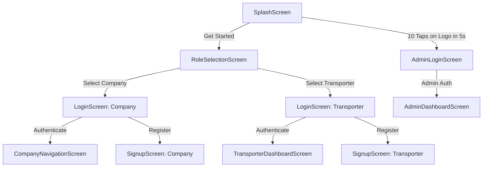
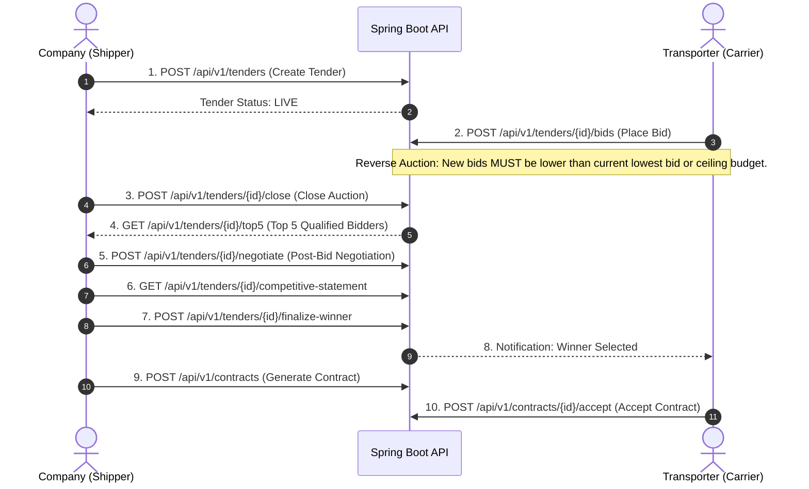

# BidHaul Reverse Auction System — Backend Integration & API Specification Contract

> **Document Status:** Authoritative Backend Contract  
> **Source Baseline:** BidHaul Feature-Complete Flutter Frontend Codebase  
> **Target System:** Spring Boot RESTful API & Persistence Engine  
> **Version:** 1.0.0  

---

## Executive Summary & System Scope

**BidHaul** is an enterprise-grade B2B Reverse Auction Platform connecting **Freight Shippers (Companies)** with **Fleet Carriers (Transporters)**. In this ecosystem, shippers publish freight transport tenders, and carriers participate in competitive reverse auctions by placing progressively lower monetary bids. The platform incorporates post-bid negotiations, automated top-5 bidder qualification, competitive statement analysis, winner finalization, contract generation, active delivery tracking, subscription management, and complete platform administration.

This document serves as the **definitive backend integration contract**. It reflects the exact data structures, fields, enums, workflow states, and user interactions present in the feature-complete Flutter frontend.

---

## 1. User Roles & Authentication Architectural Contract

### 1.1 Identity & Authorization Roles
The system distinguishes three primary roles and four user types across the application ecosystem:

| User Type / Role | Description | Access Portal / Navigation |
| :--- | :--- | :--- |
| `company` | Corporate Shippers posting freight tenders and awarding contracts. | `CompanyNavigationScreen` / `CompanyDashboardScreen` |
| `transporter` | Commercial Carriers browsing live tenders, bidding, and fulfilling loads. | `TransporterDashboardScreen` |
| `admin` | Platform Administrators handling KYC verification, audit logs, and compliance. | `AdminDashboardScreen` (via `/admin-login` or hidden gesture) |
| `super_admin` | Platform Super Administrators with full system governance. `[BACKEND DECISION REQUIRED]` | System governance endpoints |

### 1.2 Access & Entry Points



- **Hidden Admin Gesture `[FRONTEND-ONLY]`**: Tapping the logo mark 10 times within 5 seconds on `SplashScreen` routes to `AdminLoginScreen`.
- **Role Selection `[FRONTEND-ONLY]`**: User selects `company` or `transporter` on `RoleSelectionScreen`, passing `role` as an argument to `LoginScreen` or `SignupScreen`.

---

## 2. Complete Domain Models & Fields Specification

All domain models match the exact field names, data types, and enum values implemented in `lib/models/`.

### 2.1 Core Reverse Auction & Tender Models

#### `Tender` (`lib/models/tender.dart`)
Represents a freight transportation request created by a company shipper.

```dart
enum TenderStatus { draft, live, completed, cancelled }
```

| Field Name | Frontend Type | Mandatory | Description / Constraints |
| :--- | :--- | :--- | :--- |
| `id` | `String` | Yes | Unique Tender Identifier (e.g., `"TN-1001"`) |
| `title` | `String` | Yes | Title of the freight tender |
| `description` | `String` | Yes | Detailed cargo specifications and delivery terms |
| `pickupLocation` | `String` | Yes | Origin city/facility address |
| `deliveryLocation` | `String` | Yes | Destination city/facility address |
| `materialType` | `String` | Yes | Category of goods (e.g., `"Industrial Machinery"`) |
| `vehicleType` | `String` | Yes | Required vehicle configuration (e.g., `"Container 32ft"`) |
| `weight` | `String` | Yes | Gross weight payload representation (e.g., `"14 Tons"`) |
| `budget` | `String` | Yes | Maximum ceiling budget price (e.g., `"₹45,000"`) |
| `status` | `TenderStatus` | Yes | Current auction status (`draft`, `live`, `completed`, `cancelled`) |

#### `Bid` (`lib/models/bid.dart`)
Represents a monetary offer submitted by a transporter during a live reverse auction.

```dart
enum BidStatus { pending, accepted, rejected }
```

| Field Name | Frontend Type | Mandatory | Description / Constraints |
| :--- | :--- | :--- | :--- |
| `id` | `String` | Yes | Unique Bid Identifier (e.g., `"BID-501"`) |
| `tenderId` | `String` | Yes | Associated Tender Identifier reference |
| `transporterName` | `String` | Yes | Display name of the carrier fleet |
| `amount` | `String` | Yes | Offertory quote amount (e.g., `"₹42,000"`) |
| `estimatedDays` | `String` | Yes | Estimated transit duration (e.g., `"2 Days"`) |
| `remarks` | `String` | Yes | Additional terms or carrier notes |
| `status` | `BidStatus` | Yes | Decision state (`pending`, `accepted`, `rejected`) |

---

### 2.2 Qualification, Negotiation & Finalization Models

#### `QualifiedBidder` (`lib/models/qualified_bidder.dart`)
Represents a carrier qualified in the top 5 lowest bidders list.

| Field Name | Frontend Type | Mandatory | Description / Constraints |
| :--- | :--- | :--- | :--- |
| `rank` | `int` | Yes | Qualification position (1 to 5) based on lowest price |
| `transporterName` | `String` | Yes | Carrier organization name |
| `bidAmount` | `double` | Yes | Lowest placed bid amount |
| `vehicleType` | `String` | Yes | Committed vehicle specification |
| `status` | `String` | Yes | Qualification status (e.g., `"Qualified"`) |

#### `NegotiationOffer` (`lib/models/negotiation_offer.dart`)
Represents a post-auction counter-offer or negotiated rate for top-5 qualified bidders.

| Field Name | Frontend Type | Mandatory | Description / Constraints |
| :--- | :--- | :--- | :--- |
| `transporter` | `String` | Yes | Carrier organization name |
| `initialBid` | `double` | Yes | Pre-negotiation bid amount |
| `currentOffer` | `double` | Yes | Revised counter-negotiated offer price |
| `isAccepted` | `bool` | Yes | Whether the counter-offer has been accepted by company |

#### `CompetitiveBid` (`lib/models/competitive_bid.dart`)
Represents an item in the comparative summary statement comparing initial vs negotiated quotes.

| Field Name | Frontend Type | Mandatory | Description / Constraints |
| :--- | :--- | :--- | :--- |
| `rank` | `int` | Yes | Final competitive ranking position |
| `transporter` | `String` | Yes | Carrier organization name |
| `initialBid` | `double` | Yes | Initial submitted bid amount |
| `negotiatedBid` | `double` | Yes | Final negotiated bid amount |
| `winner` | `bool` | Yes | Indicator if this bid is selected as the winning offer |

#### `FinalizedContract` (`lib/models/finalized_contract.dart`)
Represents an awarded tender awaiting contract execution.

| Field Name | Frontend Type | Mandatory | Description / Constraints |
| :--- | :--- | :--- | :--- |
| `transporter` | `String` | Yes | Winning carrier name |
| `amount` | `double` | Yes | Final agreed contract price |
| `tenderId` | `String` | Yes | Associated tender reference ID |
| `status` | `String` | Yes | Contract state (e.g., `"Awaiting Acceptance"`) |

#### `AcceptedContract` (`lib/models/accepted_contract.dart`)
Represents an executed binding agreement between shipper and carrier.

| Field Name | Frontend Type | Mandatory | Description / Constraints |
| :--- | :--- | :--- | :--- |
| `id` | `String` | Yes | Unique Contract Identifier (e.g., `"CNT-901"`) |
| `company` | `String` | Yes | Shipper company name |
| `origin` | `String` | Yes | Pickup location |
| `destination` | `String` | Yes | Delivery location |
| `vehicleType` | `String` | Yes | Transport vehicle type |
| `contractAmount` | `double` | Yes | Total contract financial value |
| `pickupDate` | `String` | Yes | Scheduled pickup date |
| `acceptedOn` | `String` | Yes | Acceptance timestamp |
| `status` | `String` | Yes | Status (e.g., `"Active"`, `"Completed"`) |

---

### 2.3 Logistics & Delivery Models

#### `ActiveDelivery` (`lib/models/active_delivery.dart`)

| Field Name | Frontend Type | Mandatory | Description / Constraints |
| :--- | :--- | :--- | :--- |
| `id` | `String` | Yes | Delivery Tracking ID |
| `company` | `String` | Yes | Shipper organization name |
| `origin` | `String` | Yes | Origin address |
| `destination` | `String` | Yes | Destination address |
| `vehicleType` | `String` | Yes | Transport vehicle type |
| `amount` | `double` | Yes | Contract value |
| `pickupDate` | `String` | Yes | Actual/Scheduled pickup date |
| `expectedDelivery` | `String` | Yes | Projected arrival timestamp |
| `status` | `String` | Yes | Transit state (e.g., `"In Transit"`) |

#### `CompletedDelivery` (`lib/models/completed_delivery.dart`)

| Field Name | Frontend Type | Mandatory | Description / Constraints |
| :--- | :--- | :--- | :--- |
| `id` | `String` | Yes | Delivery Tracking ID |
| `company` | `String` | Yes | Shipper organization name |
| `origin` | `String` | Yes | Origin address |
| `destination` | `String` | Yes | Destination address |
| `vehicleType` | `String` | Yes | Transport vehicle type |
| `amount` | `double` | Yes | Final paid amount |
| `deliveredOn` | `String` | Yes | Delivery timestamp |
| `completedOn` | `String` | Yes | Settlement timestamp |
| `rating` | `String` | Yes | Shipper review rating (e.g., `"4.9 / 5.0"`) |

#### `WonAuction` (`lib/models/won_auction.dart`)

| Field Name | Frontend Type | Mandatory | Description / Constraints |
| :--- | :--- | :--- | :--- |
| `id` | `String` | Yes | Auction ID |
| `company` | `String` | Yes | Awarding Shipper |
| `origin` | `String` | Yes | Pickup point |
| `destination` | `String` | Yes | Delivery point |
| `vehicleType` | `String` | Yes | Vehicle requirement |
| `winningPrice` | `double` | Yes | Final winning bid price |
| `pickupDate` | `String` | Yes | Planned pickup date |
| `awardedDate` | `String` | Yes | Award timestamp |
| `status` | `String` | Yes | Award status (e.g., `"Awarded"`) |

---

### 2.4 User, Directory & Profile Models

#### `PlatformUser` (`lib/models/platform_user.dart`)

```dart
enum UserType { company, transporter }
enum UserStatus { active, suspended }
```

| Field Name | Frontend Type | Mandatory | Description / Constraints |
| :--- | :--- | :--- | :--- |
| `id` | `int` | Yes | Internal user sequence ID |
| `name` | `String` | Yes | Full display name |
| `email` | `String` | Yes | Primary email address |
| `phone` | `String` | Yes | Contact phone number |
| `type` | `UserType` | Yes | Account classification (`company`, `transporter`) |
| `status` | `UserStatus` | Yes | Account lifecycle state (`active`, `suspended`) |

#### `UserProfile` (`lib/models/user_profile.dart`)

| Field Name | Frontend Type | Mandatory | Description / Constraints |
| :--- | :--- | :--- | :--- |
| `name` | `String` | Yes | User display name |
| `email` | `String` | Yes | Work email address |
| `phone` | `String` | Yes | Contact number |
| `role` | `String` | Yes | Role label (e.g., `"Company Shipper"`) |
| `companyName` | `String` | Yes | Legal entity name |
| `avatar` | `String` | Yes | Profile picture URL or asset path |

#### `Transporter` (`lib/models/transporter.dart`)

| Field Name | Frontend Type | Mandatory | Description / Constraints |
| :--- | :--- | :--- | :--- |
| `id` | `String` | Yes | Carrier ID |
| `companyName` | `String` | Yes | Transport company name |
| `ownerName` | `String` | Yes | Fleet owner name |
| `phone` | `String` | Yes | Contact phone |
| `completedDeliveries` | `int` | Yes | Lifetime fulfilled trips count |
| `rating` | `double` | Yes | Average rating score (0.0 - 5.0) |
| `status` | `String` | Yes | Operating state (e.g., `"Verified"`) |

---

### 2.5 Billing, Subscription & Notification Models

#### `SubscriptionPlan` (`lib/models/subscription_plan.dart`)

| Field Name | Frontend Type | Mandatory | Description / Constraints |
| :--- | :--- | :--- | :--- |
| `name` | `String` | Yes | Plan tier name (e.g., `"Enterprise Pro"`) |
| `monthlyPrice` | `double` | Yes | Monthly recurring cost in INR |
| `description` | `String` | Yes | Plan summary bullet |
| `features` | `List<String>` | Yes | Array of enabled platform features |
| `recommended` | `bool` | Yes | Highlight flag for recommended tier |

#### `ActiveSubscription` (`lib/models/active_subscription.dart`)

| Field Name | Frontend Type | Mandatory | Description / Constraints |
| :--- | :--- | :--- | :--- |
| `planName` | `String` | Yes | Current active plan name |
| `monthlyPrice` | `double` | Yes | Recurring price |
| `startDate` | `String` | Yes | Subscription start date |
| `expiryDate` | `String` | Yes | Renewal/expiration date |
| `remainingDays` | `int` | Yes | Days remaining in current billing cycle |

#### `Invoice` (`lib/models/invoice.dart`)

| Field Name | Frontend Type | Mandatory | Description / Constraints |
| :--- | :--- | :--- | :--- |
| `invoiceNo` | `String` | Yes | Invoice code (e.g., `"INV-2026-001"`) |
| `date` | `String` | Yes | Issue date |
| `amount` | `double` | Yes | Total billed amount |
| `status` | `String` | Yes | Payment status (`"Paid"`, `"Pending"`) |

#### `AppNotification` (`lib/models/app_notification.dart`)

```dart
enum NotificationType { company, transporter, admin }
```

| Field Name | Frontend Type | Mandatory | Description / Constraints |
| :--- | :--- | :--- | :--- |
| `id` | `int` | Yes | Notification identifier |
| `title` | `String` | Yes | Notification heading |
| `message` | `String` | Yes | Notification text payload |
| `time` | `String` | Yes | Relative or formatted time string |
| `isRead` | `bool` | Yes | Read flag indicator |
| `type` | `NotificationType` | Yes | Target audience type (`company`, `transporter`, `admin`) |

---

### 2.6 Administration & Compliance Models

#### `CompanyVerification` (`lib/models/company_verification.dart`)
| Field Name | Frontend Type | Mandatory | Description / Constraints |
| :--- | :--- | :--- | :--- |
| `id` | `int` | Yes | Entity ID |
| `companyName` | `String` | Yes | Registered business name |
| `ownerName` | `String` | Yes | Representative officer name |
| `email` | `String` | Yes | Business contact email |
| `phone` | `String` | Yes | Contact phone |
| `address` | `String` | Yes | Registered office address |
| `gstNumber` | `String` | Yes | GST Identification Number |
| `licenseNumber` | `String` | Yes | Transport/Trade License No. |
| `registrationDate` | `String` | Yes | Registration timestamp |
| `status` | `String` | Yes | Verification status (`"Pending"`, `"Approved"`, `"Rejected"`) |

#### `TransporterVerification` (`lib/models/transporter_verification.dart`)
| Field Name | Frontend Type | Mandatory | Description / Constraints |
| :--- | :--- | :--- | :--- |
| `id` | `int` | Yes | Entity ID |
| `transporterName` | `String` | Yes | Transport company name |
| `ownerName` | `String` | Yes | Fleet owner name |
| `email` | `String` | Yes | Contact email |
| `phone` | `String` | Yes | Contact phone |
| `vehicleType` | `String` | Yes | Primary vehicle fleet type |
| `fleetSize` | `String` | Yes | Vehicle fleet count (e.g., `"15 Trucks"`) |
| `licenseNumber` | `String` | Yes | Commercial permit / license |
| `registrationDate` | `String` | Yes | Application date |
| `status` | `String` | Yes | Status (`"Pending"`, `"Approved"`, `"Rejected"`) |

#### `AdminAccount` (`lib/models/admin_account.dart`)
| Field Name | Frontend Type | Mandatory | Description / Constraints |
| :--- | :--- | :--- | :--- |
| `name` | `String` | Yes | Administrator name |
| `email` | `String` | Yes | Admin email address |
| `role` | `String` | Yes | Governance role (e.g., `"Super Admin"`) |
| `active` | `bool` | Yes | Account status flag |

#### `AuditLog` (`lib/models/audit_log.dart`)
| Field Name | Frontend Type | Mandatory | Description / Constraints |
| :--- | :--- | :--- | :--- |
| `action` | `String` | Yes | Description of audited operation |
| `performedBy` | `String` | Yes | User email/name executing operation |
| `dateTime` | `String` | Yes | Audit event timestamp |

---

## 3. Reverse Auction Business Flow & Rules Matrix



### Business Rules Checklist
1. **Reverse Bidding Constraint**: A valid bid amount submitted by a transporter must be strictly less than the initial tender budget and ideally lower than preceding live bids for competitive advantage.
2. **Top 5 Qualification**: When an auction closes, the system ranks all bids in ascending order of `amount` and filters the lowest 5 qualified bids.
3. **Negotiation Scope Restriction**: Only transporters in the Top 5 qualified list can participate in the post-bid negotiation cycle.
4. **Winner Selection Eligibility**: The winner must be selected from the competitive statement list generated following negotiation.
5. **Contract Binding Transition**: Finalizing a winner automatically converts the tender status from `live` to `completed` and transitions the finalized contract state to `"Awaiting Acceptance"`.

---

## 4. Proposed REST API Endpoint Specification

To connect the Flutter frontend seamlessly to the Spring Boot backend, the backend team must implement the following RESTful API contract:

### 4.1 Authentication & Profile Endpoints
- `POST /api/v1/auth/login`
  - **Body**: `{ "email": "string", "password": "string", "role": "company|transporter" }`
  - **Response**: `{ "token": "JWT_STRING", "user": PlatformUser }`
- `POST /api/v1/auth/signup`
  - **Body**: `{ "companyName": "string", "contactName": "string", "email": "string", "phone": "string", "password": "string", "role": "company|transporter" }`
  - **Response**: `{ "success": true, "user": PlatformUser }`
- `POST /api/v1/auth/admin-login`
  - **Body**: `{ "email": "string", "password": "string" }`
  - **Response**: `{ "token": "JWT_STRING", "admin": AdminAccount }`

### 4.2 Tender Management Endpoints
- `POST /api/v1/tenders` — Create new tender (`Tender`)
- `GET /api/v1/tenders` — List active/my tenders
- `GET /api/v1/tenders/{id}` — Retrieve detailed tender information
- `PUT /api/v1/tenders/{id}/close` — Manually close reverse auction

### 4.3 Bidding & Reverse Auction Endpoints
- `GET /api/v1/tenders/{id}/bids` — Fetch live submitted bids
- `POST /api/v1/tenders/{id}/bids` — Submit new reverse auction bid
- `GET /api/v1/tenders/{id}/top5` — Retrieve top 5 qualified lowest bidders
- `POST /api/v1/tenders/{id}/negotiation` — Submit counter-negotiation offer
- `GET /api/v1/tenders/{id}/competitive-statement` — Retrieve final competitive summary
- `POST /api/v1/tenders/{id}/finalize-winner` — Select winning carrier

### 4.4 Contracts & Delivery Endpoints
- `POST /api/v1/contracts` — Generate binding contract (`FinalizedContract`)
- `GET /api/v1/contracts/accepted` — List accepted contracts (`AcceptedContract`)
- `GET /api/v1/deliveries/active` — List active shipments (`ActiveDelivery`)
- `GET /api/v1/deliveries/completed` — List delivery history (`CompletedDelivery`)

### 4.5 Subscription & Administration Endpoints
- `GET /api/v1/subscriptions/plans` — Fetch active tier plans
- `POST /api/v1/subscriptions/subscribe` — Purchase/upgrade subscription
- `GET /api/v1/admin/verifications/companies` — Company KYC list
- `GET /api/v1/admin/verifications/transporters` — Carrier KYC list
- `GET /api/v1/admin/audit-logs` — Platform compliance audit logs

---

## 5. Architectural Data Classification Index

| Domain Entity / Feature | Implementation Status | Data Source / Location | Backend Requirement |
| :--- | :--- | :--- | :--- |
| User Authentication & Login | `FRONTEND-ONLY` UI | `lib/screens/auth/` | Spring Security + JWT authentication provider |
| Hidden Admin Gesture | `FRONTEND-ONLY` | `SplashScreen._onLogoTapped` | Secure admin token validation endpoint |
| Tender & Auction Data | `DUMMY DATA` | `lib/dummy/dummy_tenders.dart` | Relational table `tenders` with spatial location indexing |
| Live Bids & Bidding Log | `DUMMY DATA` | `lib/dummy/dummy_bids.dart` | Relational table `bids` + WebSocket/STOMP push `[BACKEND DECISION REQUIRED]` |
| Top 5 & Negotiation Engine | `DUMMY DATA` | `lib/dummy/dummy_qualified_bidders.dart` | Automated SQL query sorting lowest 5 bids post-closure |
| Contracts & Agreement Engine | `DUMMY DATA` | `lib/dummy/dummy_finalized_contract.dart` | PDF Generation Service & e-signature audit trail `[BACKEND DECISION REQUIRED]` |
| Subscriptions & Billing | `DUMMY DATA` | `lib/dummy/dummy_subscription_plans.dart` | Payment Gateway Integration (Razorpay/Stripe) `[BACKEND DECISION REQUIRED]` |
| Admin Compliance Audit | `DUMMY DATA` | `lib/dummy/dummy_audit_logs.dart` | Spring AOP Audit logging filter |

---

## 6. Open Decisions Required from Backend Team

1. **Real-time Auction Engine `[BACKEND DECISION REQUIRED]`**: Determine whether to use WebSocket (STOMP over SockJS) or HTTP Server-Sent Events (SSE) for pushing live bid updates to transporters and shippers during reverse auctions.
2. **Contract Generation Engine `[BACKEND DECISION REQUIRED]`**: Define the document service engine (e.g., JasperReports or iText PDF) for creating printable digital contracts from `FinalizedContract`.
3. **Database Schema Mapping `[BACKEND DECISION REQUIRED]`**: Map the Dart model string identifiers (e.g., `"TN-1001"`, `"BID-501"`) to database primary keys (UUID vs auto-incrementing BigInt).
4. **Payment Gateway Integration `[BACKEND DECISION REQUIRED]`**: Confirm Razorpay or Stripe webhook listeners for subscription plan upgrades and contract security deposit processing.

---

> **Contract Sign-off:**  
> The Flutter frontend implementation is complete and locked. Spring Boot backend services must adhere to the data types, field names, and workflow specifications outlined in this contract.
